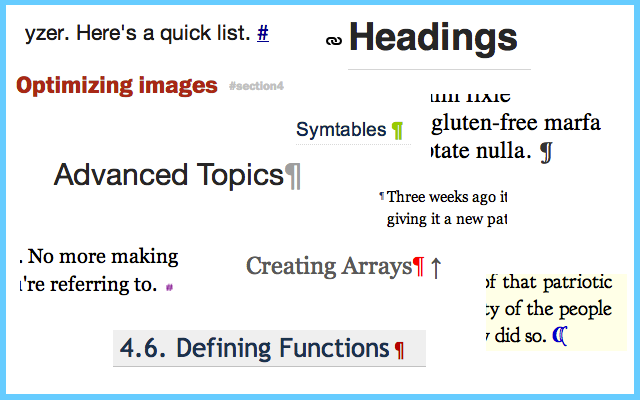

# AnchorJS [](https://github.com/bryanbraun/anchorjs/actions?workflow=Tests)

A JavaScript utility for adding deep anchor links ([like these](https://ux.stackexchange.com/q/36304/33248)) to existing page content. AnchorJS is lightweight, accessible, and has no dependencies.

**[See Live Examples in the Documentation](https://www.bryanbraun.com/anchorjs/#examples).**



## Installation

Download AnchorJS using npm,

```bash
npm install anchor-js
```

or bower:

```bash
bower install anchor-js --save-dev
```

(or just [download it from github](https://github.com/bryanbraun/anchorjs/releases)).

Then include the anchor.js file (or anchor.min.js) in your webpage.

```html
<script src="anchor.js"></script>
```

You could also include it via a CDN like [CDNJS](https://cdnjs.com/libraries/anchor-js) or [jsDelivr](https://www.jsdelivr.com/projects/anchorjs).

## Usage
See **[the Documentation](https://www.bryanbraun.com/anchorjs/#basic-usage)** for detailed instructions.

## Compatibility
Currently Supports: IE9+ and modern browsers

## Contributing [](https://david-dm.org/bryanbraun/anchorjs#info=devDependencies)
To contribute:

1. Fork/Clone the repo.
2. Make your changes.
3. Write tests as needed.
4. Run tests locally to confirm everything is working:
   - Install test modules: Run `npm ci`
   - Run all tests: `npm test`
5. Minify the code: `npm run release`
6. Submit a Pull Request.

## License
Licensed with the [MIT License](https://opensource.org/licenses/MIT).
